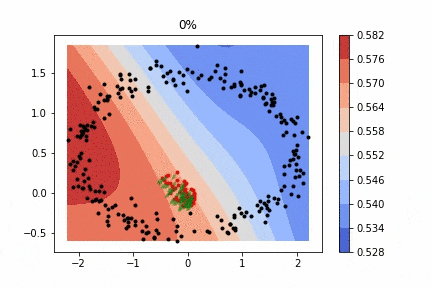
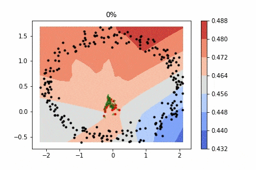
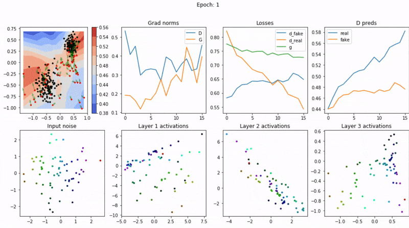
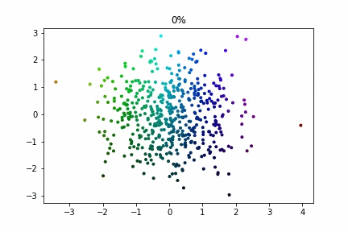

# Visualization of GAN training process

Simple playground for learning and visualizing GANs in 2d.
After dozens of hours of StyleGAN training, it may be fun 
to get GANs intuition with fast iterations (30 seconds) 
for hyperparameters (but I'm not sure that this intuition 
can be transferred to the “big” GAN models). 
Inspired by https://poloclub.github.io/ganlab, 
but maybe someone prefers to play with hyperparameters using code in Colab.

## Visualizations 
Visualization of training dynamics includes:
- real data distribution (black dots)
- generated by G "fake" data from fixed noise
- decision boundary for D for the entire input space, color coding displays the
 output probability for D (red - high probability of real data, blue - low)
- green arrows for each generated data point - direction of maximization
 D's output

### G and D without batch-norm

### G and D with batch-norm

### Metrics
The first row shows the training dynamics (with fixed noise for visualization) 
and various metrics (norm of gradients for G and D, losses and outputs of D for
real and fake). The second row shows input noise and intermediate activations
of G (projected onto 2d).

### Transformation of input noise with G

## Tunable options for playing
- input data distribution
- batch size, num epochs
- lr for D and G (probably the most important)
- optimizers for D and G
- input noise distribution
- number of neurons, activation functions
- loss function(BCE, L2)
- weights initialization
- regularization(batch-norm, dropout, weight decay)

CPU because fast enough for playing.

## Future work
- add more losses
- add more regularization techniques
